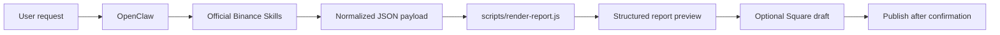

# Alpha Radar OpenClaw Skill

Alpha Radar is a GitHub-ready custom OpenClaw skill for turning Binance market data into a stable report format.

It does not replace official Binance skills. It orchestrates them into five sections:

1. 今日市场主线
2. 今日值得看名单
3. 今日风险警报
4. 今日观察钱包 / 聪明钱附录
5. 今日结论

## Why this version is stronger

Compared with the earlier scaffold, this version adds:

- stricter input validation with Zod;
- a modular renderer (`src/schema.js` + `src/render.js`);
- built-in tests with Node's native test runner;
- better OpenClaw metadata for load-time gating;
- a clearer architecture diagram;
- a lock file for reproducible installs.

## Repo structure

```text
.
├── .editorconfig
├── .github/
│   └── workflows/
│       └── check.yml
├── .gitignore
├── .prettierrc.json
├── CONTRIBUTING.md
├── LICENSE
├── README.md
├── SKILL.md
├── package-lock.json
├── package.json
├── docs/
│   ├── DATA_SCHEMA.zh-CN.md
│   ├── DEMO_SCRIPT.zh-CN.md
│   ├── SUBMISSION_CHECKLIST.zh-CN.md
│   └── VIDEO_OUTLINE.zh-CN.md
├── examples/
│   ├── sample-data.json
│   ├── sample-report.md
│   └── sample-square.txt
├── scripts/
│   └── render-report.js
├── src/
│   ├── render.js
│   └── schema.js
└── test/
    └── render-report.test.js
```

## Install locally

```bash
mkdir -p ~/.openclaw/workspace/skills
cp -R alpha-radar-openclaw-skill ~/.openclaw/workspace/skills/alpha-radar-report
```

Then refresh skills or restart OpenClaw.

## Add from GitHub

```bash
openclaw skills add https://github.com/0xXIAOc/alpha-radar-openclaw-skill
```

## Also install official Binance skills

```bash
npx skills add binance/binance-skills-hub
```

## Local test

```bash
npm install
npm run report
npm run square
npm run test
npm run check
```

Generated files:

- `examples/sample-report.md`
- `examples/sample-square.txt`

## Supported input modes

### File input

```bash
node scripts/render-report.js --input examples/sample-data.json --style report
```

### Stdin / pipe input

```bash
cat examples/sample-data.json | node scripts/render-report.js --style report
```

## Architecture



## Minimal JSON shape

```json
{
  "chain": "Solana",
  "window": "24h",
  "marketTheme": { "summary": "..." },
  "watchlist": [],
  "riskAlerts": [],
  "walletAppendix": { "summary": "..." },
  "conclusion": []
}
```

Detailed field guidance: `docs/DATA_SCHEMA.zh-CN.md`

## Security notes

- Do not hardcode API keys in this repository.
- Keep Square posting keys and exchange API keys out of Git.
- Default to preview first, then publish.
- This repository itself does not require exchange credentials; those belong in the official Binance skills that fetch data or post content.

## Repository

```text
https://github.com/0xXIAOc/alpha-radar-openclaw-skill
```

## Suggested GitHub About settings

Description:

```text
OpenClaw skill for rendering Binance market data into a structured watchlist, risk alert, and Binance Square draft.
```

Topics:

```text
openclaw skill binance web3 solana bsc square report automation
```
